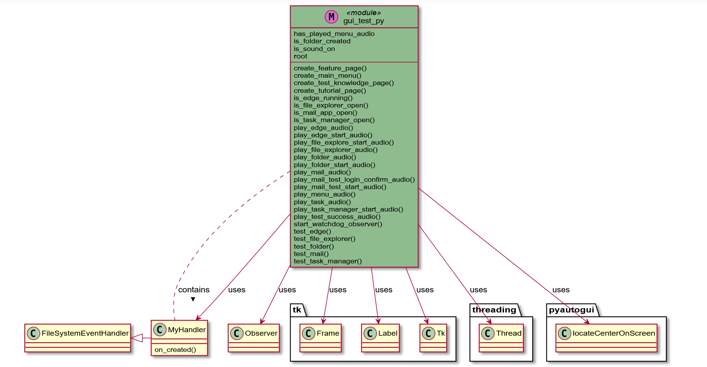

# Project Report Easy OS Interactive Tutorial
Development Team:Nikolay Sisov Nicanor Sanderson
## 1. Project Goals:
The primary objective of the "Easy_OS Interface" project is to develop an intuitive and user-friendly software application to assist elderly users in navigating and understanding basic computer operations. 
The goal is to simplify tasks like opening applications, managing files, and understanding system functionalities, thus making technology more accessible and less intimidating for senior users.

## 2. Significance of the Project:
This project holds significant value in enhancing the lives of elderly individuals by bridging the digital divide. As technology becomes increasingly integral to daily life, ensuring that older adults are not left behind is crucial. 
This application aims to empower them with the confidence and skills needed to use a computer, thereby improving their ability to connect with loved ones, access information, and engage in various online activities. 
This empowerment can lead to increased independence and a better quality of life.

## 3. Installation and Usage Instructions:
### Installation:
- Ensure you have Python installed on your system.
- Clone the project repository from [GitHub](https://github.com/Reminisce215/472-Easy-OS.git).
- Install the required dependencies through IDE choice of Pycharm or VSCode

### Usage:
1. Open the application; the main menu will be displayed.
2. Select "Tutorial" to learn about different features or "Test Knowledge" to test understanding.
3. Navigate through the tutorials or tests using the on-screen buttons.
4. Audio guidance will be provided for each test and tutorial.
5. Tutorials use mouse automation to enhance learning.
6. Windows OS required for Knowledge Testing

## 4. Code Structure:

## 5. List of Functionalities and Test Results:
### Functionalities:

1. Customizable and Extensible Structure: Modular design allows for easy addition of new tutorials, tests, or other features, making the application adaptable and scalable.

2. Audio Instructions for Tutorials: Playslays specific audio instructions for different tutorials (Edge, File Explorer, Folder Creation, Mail App, Task Manager), enhancing the learning experience for users who may prefer auditory guidance.

3. Interactive Main Menu: The main menu serves as the central hub from which users can navigate to tutorials, test their knowledge, or access other features of the application.

4. Tutorial Navigation: Users can access step-by-step tutorials on various computer functionalities, like using the Edge browser, File Explorer, Mail App, and managing folders and tasks.

5. Knowledge Testing: The code includes functions to test the user's knowledge and skills in various areas like opening and using the Edge browser, File Explorer, Mail app, and Task Manager.

6. Dynamic Image Display in Tutorials: Dynamically displays tutorial images, adjusting the displayed image based on user navigation through the tutorials.

7. Sound Management: Users have the option to toggle sound on or off, allowing them to control the auditory component of the tutorials and tests.

8. Real-time Feedback for Tests: Provides immediate feedback during tests, such as confirming folder creation or successful opening of applications like the Mail app or Task Manager.

9. Mouse Movement Automation for Tutorial Assistance: Includes functions to automatically move the mouse cursor to demonstrate actions during tutorials, aiding users in understanding the tasks being taught.

10. Folder Creation Monitoring: Usesses a watchdog observer to monitor the user's Desktop for new folder creation, which is a part of the test functionality to help users learn basic computer operations.

### Test Results:
- User acceptance testing was performed to validate the user interface's effectiveness.
- Tested on various monitors to confirm accurate mouse automation across platform. 

## 6. Discussion and Conclusions:
### Project Issues:
- Dependency on specific operating system features may limit cross-platform compatibility.
- Requires pre-loaded audio files, limiting customizability.

### Application of Course Learnings:
- input output devices knowledge
- process monitoring
- Integration of event-driven programming and multi-threading

## Conclusion:
The Easy_OS Interface successfully demonstrates the application of fundamental software development concepts to create a real-world solution. 
While there are areas for improvement, such as enhancing cross-platform capabilities, the project adequately achieves its goal of assisting elderly users in computer navigation, thereby promoting inclusivity in the digital realm.
